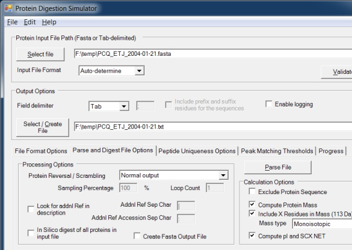
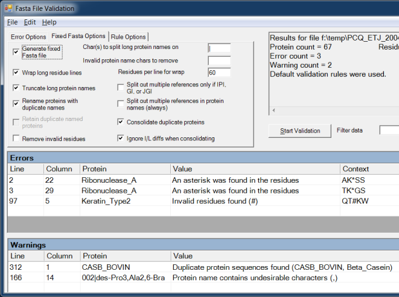

# __Protein Digestion Simulator__
The Protein Digestion Simulator can be used to read a text file containing protein or peptide sequences (FASTA format or delimited text) then output the data to a tab-delimited file.

### Description
The Protein Digestion Simulator can optionally digest the input sequences using trypsin, partial trypsin rules, or various other enzymes. The digested peptides will also have predicted normalized elution time (NET) values computed for them.

The Fasta File Validation module can be used to validate a FASTA file, testing it against a set of rules that identify common formatting errors. You can optionally create a fixed Fasta file, where various protein naming issues are fixed. By default, long protein names will be shortened and invalid residues will be removed. The processing will also look for proteins with duplicate sequences or duplicate names and can optionally remove the duplicate proteins when creating the fixed fasta file.

An advanced feature of the the Protein Digestion Simulator is the ability to calculate the number of uniquely identifiable peptides within an input file using only mass, or both mass and NET, given user-defined tolerances.

### Downloads
* [Latest Installer](https://github.com/PNNL-Comp-Mass-Spec/Protein-Digestion-Simulator/releases/latest)
* [Latest Executable (AppVeyor)](https://ci.appveyor.com/project/PNNLCompMassSpec/protein-digestion-simulator/build/artifacts): This may be a newer version of the executable than in the latest installer
* [Source code on GitHub](https://github.com/PNNL-Comp-Mass-Spec/Protein-Digestion-Simulator)

#### Software Instructions
##### Parse/Digest File Options
The software can read a FASTA file or delimited text file containing protein or peptide sequences then create a new text file with the protein name, description, and sequence separated by tabs.  This makes it very easy to import the data into Microsoft Excel or Access.  Also supports creating a new FASTA file with all of the protein sequences reversed or even randomized. This new file can be the equivalent length of the original file, or can include just a subset of the original file.

##### FASTA File Validation
The software can parse a FASTA file to check for formatting errors, including duplicate protein names, duplicate protein sequences, long protein names, long protein residue lines, invalid residues, spaces in inappropriate places, protein entries without a description, etc.

### Acknowledgment

All publications that utilize this software should provide appropriate acknowledgement to PNNL and the Protein-Digestion-Simulator GitHub repository. However, if the software is extended or modified, then any subsequent publications should include a more extensive statement, as shown in the Readme file for the given application or on the website that more fully describes the application.

### Disclaimer

These programs are primarily designed to run on Windows machines. Please use them at your own risk. This material was prepared as an account of work sponsored by an agency of the United States Government. Neither the United States Government nor the United States Department of Energy, nor Battelle, nor any of their employees, makes any warranty, express or implied, or assumes any legal liability or responsibility for the accuracy, completeness, or usefulness or any information, apparatus, product, or process disclosed, or represents that its use would not infringe privately owned rights.

Portions of this research were supported by the NIH National Center for Research Resources (Grant RR018522), the W.R. Wiley Environmental Molecular Science Laboratory (a national scientific user facility sponsored by the U.S. Department of Energy's Office of Biological and Environmental Research and located at PNNL), and the National Institute of Allergy and Infectious Diseases (NIH/DHHS through interagency agreement Y1-AI-4894-01). PNNL is operated by Battelle Memorial Institute for the U.S. Department of Energy under contract DE-AC05-76RL0 1830.

We would like your feedback about the usefulness of the tools and information provided by the Resource. Your suggestions on how to increase their value to you will be appreciated. Please e-mail any comments to proteomics@pnl.gov
